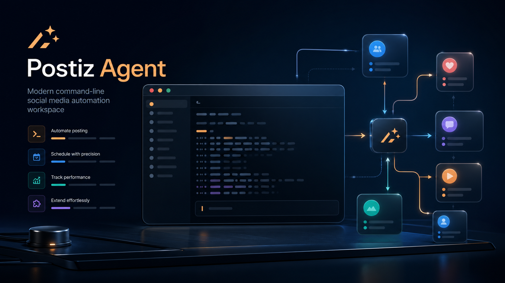

# Postiz Agent Skill



A reusable Hermes skill and documentation set for working with Postiz through the CLI or public API.

## What this repo contains

- a reusable Hermes skill for Postiz scheduling and verification
- public API notes
- multi-account / multi-workspace guidance
- a banner image for documentation and sharing

## What the skill does

- checks whether Postiz is connected
- lists integrations before scheduling anything
- schedules posts with the right integration ID
- verifies the created post by reading it back
- works across different accounts as long as the target integration is connected in the current workspace

## Quick start

### 1. Install the skill

If you want the published package, install it with:

```bash
npx skills add gitroomhq/postiz-agent
```

If you want to use the local repo copy instead:

```bash
cp -R skills/mcp/postiz-agent ~/.hermes/skills/mcp/
```

### 2. Use the CLI or API

```bash
postiz integrations:list
postiz posts:create -c "Hello from Postiz" -s "2026-08-04T09:00:00Z" -i "<integration-id>"
```

### 3. Verify

Always read the created post back before saying it is scheduled.

## Documentation

- [`docs/usage.md`](docs/usage.md)
- [`docs/account-portability.md`](docs/account-portability.md)
- [`skills/mcp/postiz-agent/references/postiz-public-api.md`](skills/mcp/postiz-agent/references/postiz-public-api.md)

## Notes

This repo intentionally avoids hard-coding a single account. Postiz account choice is driven by the integration list in the current workspace.
